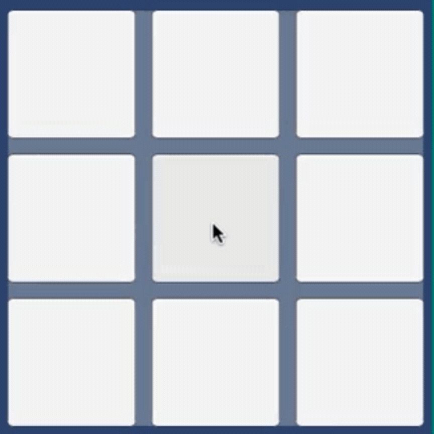

# Can a complete beginner in Unity create a game using only ChatGPT?

## What did I make?
A simple player vs. computer tic-tac-toe game on Unity. Solely used OpenAI's GPT-4 (gpt-4-0314) as a guide.

## Why did I make this?
To test ChatGPT's capabilities in teaching a complete beginner how to create games in the Unity environment.

My capabilities as a programmer was basic to intermediate at this stage. Unity uses C# as its scripting language. My background is in Electrical and Electronic Engineering and have previous experience in: Matlab, C, C++, Python, and Assembly. All previous applications of coding were solely for engineering; zero game-making experience.

## Results
There is a rudimentary tic-tac-toe game that can be played. Functioning buttons and appropriate feedback of `X`'s (player) and `O`'s (computer) to match. Win/lose/draw detection. When a game is finished, it clears the board and restarts after a few seconds.

**Gif to be inserted**

The computer can determine when the player is about to win and can block intentionally.

The computer cannot determine when it is about to win. The computer only has a basic strategy - unless the player is about to win, place randomly.

**Gif to be inserted**

## Method
It must be noted that the method below is not the initial method, but the final method which lead to the creation of the current state of the game. Lessons learned from experimentation are highlighted in this document.

1. Used OpenAI's ChatGPT, gpt-4-0314. Introduce the task to ChatGPT: Ensure that prompt contains "provide step-by-step instructions" and "include all code needed", or similar. The first instruction is to only generate an overview of the subsystems required for a tic-tac-toe game. 
2. Once the subsystems have been layed out, study the whole game system. 
3. In a new prompt, re-introduce the context and the newly generated subsystems plan. This time, prompt ChatGPT to create **one** of the subsytems.
4. Once created, implement the subsystem in Unity as per the instructions.
5. Ask ChatGPT how test the new subsystem and what to behaviour to expect, if applicable.
6. If there are bugs, relay the bug report and be as detailed as possible to ChatGPT. Remedy any bugs as required.
7. Ask ChatGPT to briefly summarise what was achieved. Record this summary.
8. Repeat from step 3 for a new subsytem. This time, append the summary of what has occurred before. Repeat steps 3 to 7 until all subsytems have been implemented and tested this way.

## Prerequesites
Unity Hub and Unity Editor.

## Replication instructions
To replicate the game locally follow these instructions:
1. Download Unity Hub and Unity Editor. Version 2021.3.24f1 for the Unity Editor was used for this project. Different versions may not be compatible. 
2. Find a directory to place the tic-tac-toe Unity project files in. 
3. Enter the directory and use `git clone https://github.com/sobalugo/chatgpt_tictactoe_test.git` in a terminal. Check that the files are there.
4. Add the project in Unity by starting Unity Hub. Click on the `Add` button and navigate to the tic-tac-toe directory. Unity Hub will auto-populate the rest of the required files for the project.
5. Click on the project to open (with Unity Editor).

## Usage
1. Once the tic-tac-toe project in Unity has been set up and opened, go to the `Project` tab and open the `Assets` folder. Open the `Scenes` folder. Double-click the `TicTacToe` scene.
2. Click on the Unity play button at the top.
3. Click on the box to place an X. The computer responds with an O somewhere else on the board.
4. Once the game is over, wait a few seconds and the game will restart.
5. Press play again.

## Lessons
1. **Making the game could not fit within one context window**: Token limits meant that GPT-4 could not simply ingest all of the instructions, then output the full method and code, within one context window. This applied even for a relatively simple game of tic-tac-toe.

2. **Begin with an overall picture**: Begin with a subsystems overview to see the overall architecture. Then these subsystems can be implemented one-by-one to fit within the token limit.

3. **Give detailed bug reports to ChatGPT**: When encountering bugs, ensure that the details are related to ChatGPT with high detail. Ideally test after implementing a new system.

4. **Accelerating learning**: ChatGPT is capable of reducing the steep learning curve in creating games on Unity. It is able to provide guidance when creating game logic and functions. Feedback can be obtained when encountering bugs and suggests improvements.

## Future work
1. **Improve the computer**: It should seek to win and not solely block the opponent trying to win.

2. **Implement a new game solely using ChatGPT again**: This time a trivia game might be a little more complicated. The goal is to push the current method of divide-and-conquer and find some more insights to addressing the token limits of LLMs. We will use GPT-4 again to access OpenAI's APIs and auto-generate questions from a select list of subjects. We will also use it for auto-evaluating human answers.